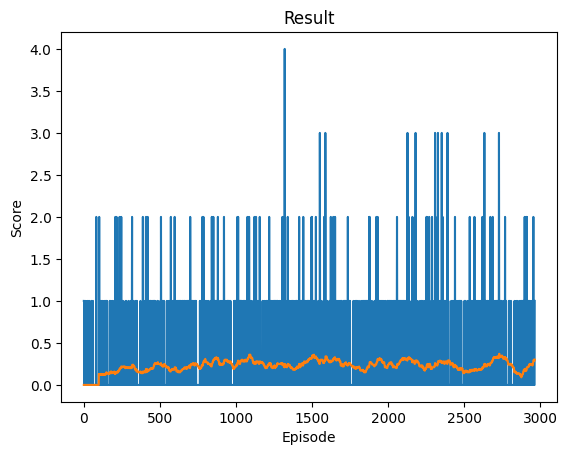
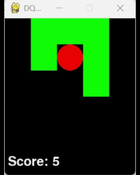

# Snake-DQN

:warning: **WORK IN PROGRESS** :warning:

## First results

## Problems Encountered

### Poor Results
At the beginning, with bad hyperparameters, the results were quite poor. 

  

After more than 3,000 trials, the model still achieved less than 0.5 points per game on average, which is not good.  

### Infinite Loop
Another issue discovered during this project: sometimes, with my second configuration, the agent gets stuck in an infinite loop.  
To avoid this behavior, we can add a condition that ends the game after 200 steps and penalizes the agent.  

  

## Final Results

## Resources
- [PyTorch RL Tutorial](https://docs.pytorch.org/tutorials/intermediate/reinforcement_q_learning.html)  
- [PyTorch Advanced: Pendulum](https://docs.pytorch.org/tutorials/advanced/pendulum.html)  
- [Mario RL Tutorial](https://docs.pytorch.org/tutorials/intermediate/mario_rl_tutorial.html)  
- [Stanford CS229 Project Report](https://cs229.stanford.edu/proj2016spr/report/060.pdf)  
- [DQN Paper (Mnih et al., 2015)](https://arxiv.org/pdf/1509.06461)
