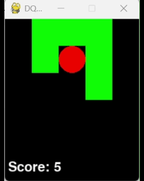

# Snake-DQN

This project is an implementation of a Deep Q-Network (DQN) agent that learns to play the classic game of Snake. The agent is trained using reinforcement learning to maximize its score by eating food and avoiding collisions.

## Features

*   **Snake Game Environment**: A custom Snake game environment built with `gymnasium`.
*   **DQN Agent**: A Deep Q-Network agent implemented with `PyTorch`.
*   **Experience Replay**: An experience replay buffer to store and sample agent's experiences for efficient training.
*   **Visualization**: A script to visualize the trained agent playing the game using `pygame`.

## Installation

1.  Clone the repository:
    ```bash
    git clone https://github.com/<YOUR_GITHUB_USERNAME>/Snake-DQN.git
    ```
2.  Navigate to the project directory:
    ```bash
    cd Snake-DQN
    ```
3.  Install the dependencies:
    ```bash
    pip install -r requirements.txt
    ```

## Usage

### Training

To train the agent, you can run the `main.ipynb` notebook. This notebook will guide you through the training process and allow you to visualize the agent's learning progress.

### Visualization

To visualize a trained agent, run the `visualise.py` script:

```bash
python visualise.py
```

This will open a `pygame` window where you can see the agent playing the game.

## Results

### Infinite Loop
During development, an issue was discovered where the agent sometimes gets stuck in an infinite loop with a specific configuration. To mitigate this, a condition can be added to end the game after 200 steps and penalize the agent.


*This section can also be updated with the results of your trained agent, such as the average score, the maximum score, and any interesting behaviors you observed.*
## Resources

- [PyTorch RL Tutorial](https://docs.pytorch.org/tutorials/intermediate/reinforcement_q_learning.html)  
- [PyTorch Advanced: Pendulum](https://docs.pytorch.org/tutorials/advanced/pendulum.html)  
- [Mario RL Tutorial](https://docs.pytorch.org/tutorials/intermediate/mario_rl_tutorial.html)  
- [Stanford CS229 Project Report](https://cs229.stanford.edu/proj2016spr/report/060.pdf)  
- [DQN Paper (Mnih et al., 2015)](https://arxiv.org/pdf/1509.06461)
